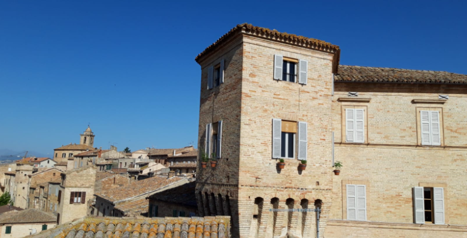

# Il Torrione

Il Torrione is a beautiful accommodation situated in Carassai, a medieval town in Ascoli Piceno Province, Italy.
This project is aimed to propose the rental of this fantastic tower, adiacent to the original boundary walls, still visible in parts of the town.
The site will be targeted towards couples, passionate about architecture and curious to experience this exclusive setting, overlooking the Apeninnes and the Adriatic Sea.
Il Torrione website will be a useful tool to communicate with the host and ask all the questions the guests might have.  It will also allow to book some extra activities presented in the "Things to do" page.

## Features 

### Existing Features

- __Navigation Bar__

  - Featured on all three pages, the fully responsive navigation bar includes links to Il Torrione Logo, Home page, "Things to do" and Contact Us page,  and it is identical in each page to allow for easy navigation.
  - This section will allow the user to easily navigate from page to page across all devices without having to revert back to the previous page via the ‘back’ button. 

- __The landing page image__

  - The landing page includes a photograph of the tower from the outside, to allow the user to see exactly what kind of accommodation they can expect. 
  - This section introduces the user to Il Torrione with an eye catching animation to grab their attention.

- __Description Section__

  - The Description section will allow the user to see the inside of Il Torrione, with a quick view of the different rooms.
  - This user will see the value of renting the premises, having the opportunity to see he main features that the accommodation will offer. 

- __Map section__

  - This section will allow the user to see exactly where Il Torrione is situated. 
  - The map is interactive and allow the user to place the accommodation in its town Carassai, as well as in Le Marche Region. 

- __The Footer__ 

  - The footer section includes links to the relevant social media sites for Il Torrione. The links will open to a new tab to allow easy navigation for the user. 
  - The footer is valuable to the user as it encourages them to keep connected via social media.
  - The last link redirects to the Booking.com page.

- __Thing to do__

  - The "Things to do" will provide the user with a list of possible tours that the host is able to arrange for the guests upon request. 
  - This section is valuable to the user as they will be able to easily identify the types of events the organisation puts together. 

- __The Contact Us Page__

  - This page will allow the user to get contact Il Torrione with any questions they might have. 
  - The user will be able specify if they would like to check availabilities, enquire about possible tours, or ask any other question. 
  - The form collects the user full name and an email address. 

### Features Left to Implement

- New page with photo gallery and guests review, when there will be enough content for it to be implemented.

## Testing 

I tested this page in different browsers: Chrome, Edge, Safari.

The project is responsive, and it looks and works well on different browsers and screen sizes.

### Validator Testing 

- HTML
  - No errors were returned when passing through the official [W3C validator](https://validator.w3.org/nu/?showsource=yes&showoutline=yes&showimagereport=yes&doc=https%3A%2F%2Fvalep314.github.io%2Fproject1%2Findex.html)

- CSS
  - No errors were found when passing through the official [(Jigsaw) validator](https://jigsaw.w3.org/css-validator/validator?uri=https%3A%2F%2Fvalep314.github.io%2Fproject1%2Findex.html&profile=css3svg&usermedium=all&warning=1&vextwarning=&lang=en)

- Accessibility
  - Performance, accessibility and best practices were assessed through Lighthouse in devtools and passed the tesing with good scores.
  

### Fixed Bugs

- Removed duplicate section tag in activities page.
- Removed duplicate closing tag on Instagram icon on the 3 pages.
- Formatted images name, removing space from the names and changing the path on individual pages.

### Unfixed Bugs
None

## Deployment

- The site was deployed to GitHub pages. The steps to deploy are as follows: 
  - In the GitHub repository, navigate to the Settings tab 
  - From the menu, select Pages
  - From the Branch section drop-down menu, select the Main Branch
  - Once the main branch has been selected, the page will be automatically refreshed with a detailed ribbon display to indicate the successful deployment. 

The live link can be found here - [Il Torrione](https://valep314.github.io/project1/)

## Credits  

### Content 

- The main structure and the README file are inspired to the Love Running project.
- The icons in the footer were taken from [Font Awesome](https://fontawesome.com/)
- The map is taken from GoogleMaps.
- The colour for the form was selected through [Coolors](https://coolors.co/)

### Media

- The wine tasting photo on the Activities section is from Pexels by Pixabay: https://www.pexels.com/photo/close-up-of-wine-and-fruits-248413/.
- The Apennines photo on the Activities section is from Unsplash by Damiano Lingauri: https://unsplash.com/photos/dWTONPnv3g8.
- The Ascoli photo on the Activities section is from Unsplashed by Marco Faccini: https://unsplash.com/photos/Po8W4z1OaRw.
- The beach photo on the Activities section is from Unsplashed by Simonetta Sambiase: https://unsplash.com/photos/5Qj4wMsx7nE.

